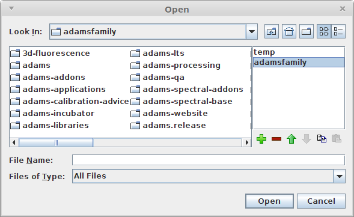
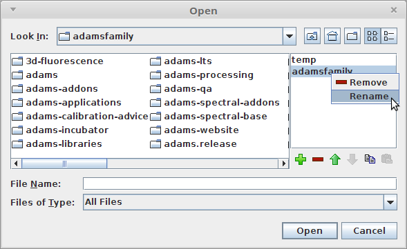

# jfilechooser-bookmarks

This Swing component is intended to be used as _accessory_ for the JFileChooser widget. The user is able to add/delete/reorder directory bookmarks that are shown on the right-hand side when using the cross-platform _Metal_ look'n'feel. Clicking on a bookmark entry automatically switches to the directory represented by this bookmark.

## Screenshots

Default view:



Ability to rename bookmarks:




## Maven ##
You can use the following dependency in your `pom.xml`:
```xml
<dependency>
  <groupId>com.github.fracpete</groupId>
  <artifactId>jfilechooser-bookmarks</artifactId>
  <version>0.1.8</version>
</dependency>
```


## Non-Maven ##
You can download jar files from Maven Central:

[search for com.googlecode.jfilechooser-bookmarks](http://search.maven.org/#search|ga|1|g%3A%22com.googlecode.jfilechooser-bookmarks%22)


## Default usage ##
The following example uses the default panel. The bookmarks get saved as Java properties file in the user's home directory (`$HOME/.jfcb/FileChooserBookmarks.props`).

```java
import java.io.File;
import javax.swing.JFileChooser;
import com.googlecode.jfilechooserbookmarks.DefaultBookmarksPanel;

public class Default {
  public static void main(String[] args) throws Exception {
    JFileChooser chooser = new JFileChooser();
    chooser.setMultiSelectionEnabled(true);
    chooser.setAcceptAllFileFilterUsed(true);
    DefaultBookmarksPanel panel = new DefaultBookmarksPanel();
    // the panel needs to know which JFileChooser to notify when the user
    // selects a bookmark and the current directory needs to change
    panel.setOwner(chooser);
    chooser.setAccessory(panel);
    int retVal = chooser.showOpenDialog(null);
    if (retVal == JFileChooser.APPROVE_OPTION) {
      for (File file: chooser.getSelectedFiles())
        System.out.println(file);
    }
  }
}
```


## Custom properties handler ##
The following example uses a custom properties handler (and therefore custom factory and panel) for storing the bookmarks as Java properties in `$HOME/.jfcb.props`:

```java
import java.io.File;
import javax.swing.JFileChooser;
import com.googlecode.jfilechooserbookmarks.AbstractBookmarksPanel;
import com.googlecode.jfilechooserbookmarks.AbstractFactory;
import com.googlecode.jfilechooserbookmarks.AbstractPropertiesHandler;
import com.googlecode.jfilechooserbookmarks.DefaultFactory;

public class CustomHandler {
  
  public static class CustomPropertiesHandler
    extends AbstractPropertiesHandler {

    protected String getFilename() {
      return System.getProperty("user.home") + File.separator + ".jfcb.props";
    }
  }

  public static class CustomFactory
    extends DefaultFactory {
    
    public AbstractPropertiesHandler newPropertiesHandler() {
      return new CustomPropertiesHandler();
    }
  }
  
  public static class CustomFileChooserBookmarksPanel
    extends AbstractBookmarksPanel {

    protected AbstractFactory newFactory() {
      return new CustomFactory();
    }
  }
  
  public static void main(String[] args) throws Exception {
    JFileChooser chooser = new JFileChooser();
    chooser.setMultiSelectionEnabled(true);
    chooser.setAcceptAllFileFilterUsed(true);
    CustomFileChooserBookmarksPanel panel = new CustomFileChooserBookmarksPanel();
    // the panel needs to know which JFileChooser to notify when the user
    // selects a bookmark and the current directory needs to change
    panel.setOwner(chooser);
    chooser.setAccessory(panel);
    int retVal = chooser.showOpenDialog(null);
    if (retVal == JFileChooser.APPROVE_OPTION) {
      for (File file: chooser.getSelectedFiles())
        System.out.println(file);
    }
  }
}
```
